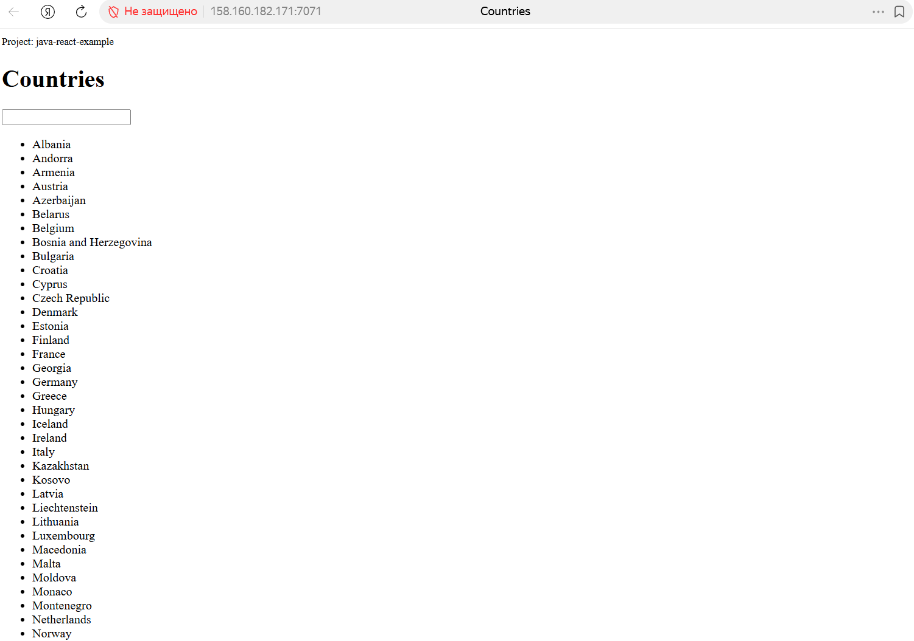
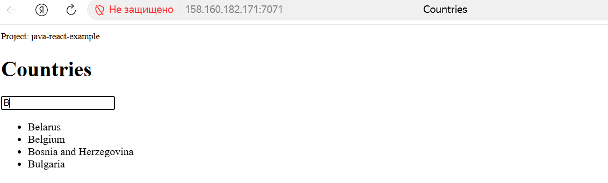

# Demo Project

## 📌 Overview
Create a server and deploy a Java application on YandexCloud.

---

## 🛠 Technologies Used
- YandexCloud
- Linux
- Java
- Gradle

---

## 📖 Project Description

- Set up and configure a server on Compute Cloud VM  
- Create and configure a new Linux user on the Compute Cloud VM (security best practices)  
- Deploy and run a Java Gradle application on the Compute Cloud VM

---

## 🚀 Java-React APP

An example of how to use JS frontend to consume an endpoint written in Java.

### Frontend technologies

- [React](https://facebook.github.io/react/) - UI Library
- [Redux](http://redux.js.org/) - State container

---

## 🌐 Live Demo

The application can be accessed at:

http://158.160.182.171:7071/

> ⚠️ Note: The address may be unavailable if the cloud server is inactive (for example, if the hosting service has not been paid).

---

## 📸 Screenshots

